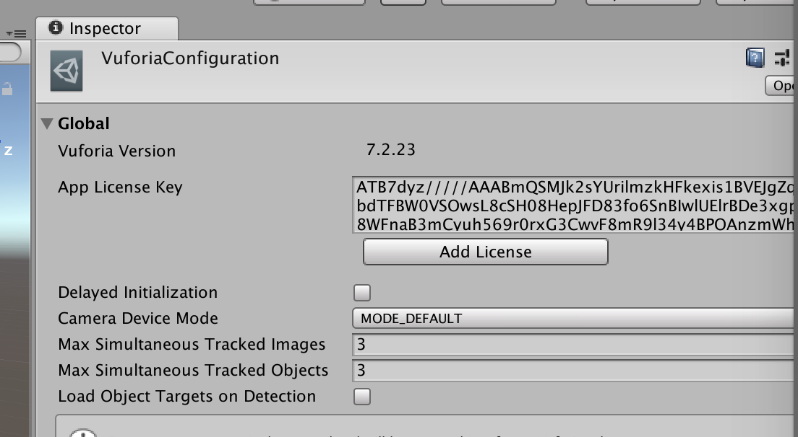

# OfferZen Make Day Augmented Reality Starter Project

This is a starter project to [build an augmented reality app with Root insurance](https://make.offerzen.com/course/root-insurance-augmented-reality) for the [Make](https://make.offerzen.com/) day course by [OfferZen](https://www.offerzen.com/).

## Prerequisites

1. Clone or download this starter project to your machine.
1. Download and install Unity via [Unity Hub](https://unity3d.com/get-unity/download). Vuforia comes bundled with Unity. While it's downloading, continue with this process.
1. Get a [Vuforia App Licence Key](https://developer.vuforia.com/vui/auth/register) and put it in the "App Licence Key" field under `Vuforia Configuration -> Global` via the "Window" option in the app toolbar.
1. Create a new Vuforia "Device" database to hold your tracking images.
1. Upload the following two target tracking images to your Vuforia database:
   1. [`egg1`](https://github.com/OfferZen-Make/arinsuretech-kicker/blob/master/Assets/egg1.jpeg)
   1. [`egg2`](https://github.com/OfferZen-Make/arinsuretech-kicker/blob/master/Assets/egg2.jpeg)
1. Download your Vuforia database to a known location and import it into your Unity project.

## Walkthrough Screencast

Watch the [walkthrough screencast](https://drive.google.com/a/fireid.com/file/d/1J9nmuZbas7Fu9cUyj-eBiqYLIi1205Wq/view) detailing how to set up Unity and Vuforia, or jump to your area of concern:

1. Register for Vuforia [00:15](https://drive.google.com/file/d/1J9nmuZbas7Fu9cUyj-eBiqYLIi1205Wq/view?t=0m15s)
1. Overview of Unity [01:27](https://drive.google.com/file/d/1J9nmuZbas7Fu9cUyj-eBiqYLIi1205Wq/view?t=1m17s)
1. Activate Vuforia License Key in Unity [02:10](https://drive.google.com/file/d/1J9nmuZbas7Fu9cUyj-eBiqYLIi1205Wq/view?t=2m10s)
1. Turn on Vuforia "AR Support" [02:44](https://drive.google.com/file/d/1J9nmuZbas7Fu9cUyj-eBiqYLIi1205Wq/view?t=2m44s)
1. Create online Vuforia database and upload image targets [03:36](https://drive.google.com/file/d/1J9nmuZbas7Fu9cUyj-eBiqYLIi1205Wq/view?t=3m36s)
1. Download the Vuforia database and import it in Unity [06:50](https://drive.google.com/file/d/1J9nmuZbas7Fu9cUyj-eBiqYLIi1205Wq/view?t=6m50s)
1. Manipulate an `ImageTarget` [07:10](https://drive.google.com/file/d/1J9nmuZbas7Fu9cUyj-eBiqYLIi1205Wq/view?t=7m10s)
1. Add a second `ImageTarget` and a prefab (prefabicated asset) [09:37](https://drive.google.com/file/d/1J9nmuZbas7Fu9cUyj-eBiqYLIi1205Wq/view?t=9m37s)
1. Interact with `ImageTarget` using a script [12:25](https://drive.google.com/file/d/1J9nmuZbas7Fu9cUyj-eBiqYLIi1205Wq/view?t=12m25s)
1. Collision detection between a ball and a capsule [16:30](https://drive.google.com/file/d/1J9nmuZbas7Fu9cUyj-eBiqYLIi1205Wq/view?t=16m30s)
1. Reset ball position [19:35](https://drive.google.com/file/d/1J9nmuZbas7Fu9cUyj-eBiqYLIi1205Wq/view?t=19m35s)
1. Make a Root API call [20:32](https://drive.google.com/file/d/1J9nmuZbas7Fu9cUyj-eBiqYLIi1205Wq/view?t=20m32s)
1. Questions and Bye! [23:38](https://drive.google.com/file/d/1J9nmuZbas7Fu9cUyj-eBiqYLIi1205Wq/view?t=23m38s)

Great, you got this far. You're almost there!

## Get Started with Local Development

1. Open this repository as a project in Unity.
1. Import the Vuforia "Device" database you downloaded in the previous section.
1. In the bottom-left, you should see two tabs titled "Project" and "Console". Take note of any unexpected errors under the "Console" tab. Common pitfalls are addressed below.
1. Under the "Project" tab, navigate to the folder `Assets -> Scenes` and open the scene called `SampleScene`.
1. Under the "Project" tab, navigate to `Assets -> Resources` and click on `Vuforia Configuration`.
1. Add your generated Vuforia App License Key in the Vuforia Inspector (on the right).
1. Tick the `Vuforia Augmented Reality Support` checkbox under `Edit -> Project Settings -> Player`.
1. Select the imported targed in `Image Target Behaviour` In the `ImageTarget` GameObject.
1. Click the `Play` button (middle top) and have fun!

## Common Pitfalls

 - "My external USB webcam not listed in Vuforia." This can be caused by version migration issues, or when the webcam was unplugged while starting Unity. 
 - "Vuforia only tracks one target at a time." There is a default limit of 1 tracking targets.
 

## Helpful Hints
 
 - Right-click inside the hierachy tree (on the left) to quickly add new nodes.
 - To rotate the viewport, hold <kbd>Alt</kbd> (on PC) or <kbd>Option</kbd> (on Mac) while dragging.
 - To pan the viewport, hold <kbd>Alt+Cmd</kbd> (on Mac) or <kbd>Option</kbd> (on PC) while dragging.
